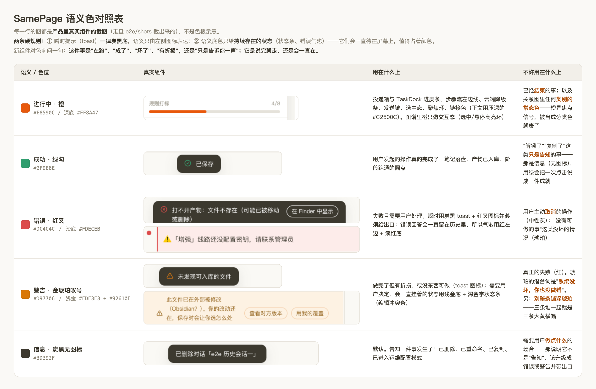

# 语义色对照表（SamePage · 品牌三期定稿）

> 2026-08-18 定稿（同日三期修订：toast 改「一种底色 + 语义图标」、琥珀改金琥珀、图谱橙退出常态色）
> 适用范围：desktop 渲染层的一切新组件
> 数值真相源仍是 `desktop/src/renderer/src/styles/theme.css`，本文只定**什么时候用哪一支**。

表里每一格的图都是**产品里真实组件的截图**（从 `desktop/e2e/shots/` 裁的），不是色板示意——
色板示意会骗人：同一支橙画成 200×60 的方块都好看，落到 4px 高的进度条上是另一回事。

## 两条硬规则（先看这个，再看色表）

1. **瞬时提示（toast）一律炭黑底，语义只由左侧图标表达。**
   成功=绿勾 / 错误=红叉 / 警告=金琥珀叹号 / 信息=无图标。
   三期之前是"按语义整条铺底"，结果三条琥珀「未发现可入库的文件」堆在一起就是三条大黄横幅——
   一条说完就走的提示不该占这么强的视觉权重。
2. **语义底色只给持续存在的状态**：云端降级条（橙）、编辑冲突条（浅金底深金字）、
   错误气泡（红左边 + 淡红底）。它们会一直待在屏幕上，值得占着颜色。

## 五支色与判据

| 语义 | token | 判据（一句话） | 典型落点 |
|---|---|---|---|
| **进行中** | `--color-accent` `#E8590C`（深底 `#FF8A47`） | 事情**还在跑**，或系统正处在降级状态 | 投递箱/TaskDock 进度条、步骤流左边线、云端降级条、发送键、选中态、聚焦环；**关系图里只做交互态**（选中/悬停高亮环） |
| **成功** | `--color-ok` `#2F9E6E` | 用户发起的操作**真的完成了**，有可验证的结果落地 | toast 的绿勾图标、产物「已入库 ✓」、阶段跑通的圆点 |
| **错误** | `--color-danger` `#DC4C4C`（淡底 `#FDECEB`） | **失败**，而且需要用户做点什么 | toast 的红叉图标、错误气泡的红左边+淡红底、删除确认的主按钮 |
| **警告** | `--color-warning` `#D97706`（浅金 `#FDF3E3` + 深字 `#92610E`） | 做完了但**有折损**，或压根没东西可做；系统没坏、用户也没做错 | toast 的叹号图标、编辑冲突条、「几个文件没转换成」 |
| **信息** | `--color-ink` `#3D392F` | **只是告诉你一声**，不需要任何后续动作 | 已删除 / 已重命名 / 已复制 / 已进入运维配置模式（**默认档，无图标**） |

**琥珀为什么从 `#B8761F` 换成 `#D97706`**：旧值压在暖白纸面上发芥末，整条铺底时最明显。
金琥珀更亮更干净；同时约定它**只出现在 toast 图标与持续状态条**上，不再整条铺深色。

## 三条容易踩错的边界

1. **"解锁了""复制了"不是成功，是信息**。管理员区 7 连点解锁提示按信息（炭黑）出——
   解锁是"告知发生了什么"，不是"任务成功"，更不是"进行中"。用绿会把一次点击说成一件成就。
2. **取消不是错误**。用户主动停下的投递用**中性灰**（`--color-muted-soft`），不进红也不进失败列表。
   这条在设计 §5.1 就定了，配色重做时原样保留。
3. **"没有可做的事"不是失败**。拖进来一个目录、里面没有可入库的格式 → 琥珀。
   报红会让人以为程序坏了，跑去查日志。

## 组件几何的一条硬规则

**toast 的几何只有一份**：圆角（12px）、字号（13px）、内边距（10/16）、图标与文案与按钮之间的
间距（10px）全部写死在 `components/ui.tsx` 的 `TOAST_BOX` 一处；
**宽度按文案自适应，上限 420px**（短文案短框），动作按钮是同一颗描边胶囊、永远在文案右侧。
走查每轮把整轮采到的 toast 样本（同屏三条 + 保存成功 + 删除 + 带按钮的错误）逐项比：
底色必须**全一样**、圆角/字号/内边距/宽度上限必须一致、图标必须与语义对得上。

**踩坑记录（两条，都在同一天）**：
- 曾把宽度写死成 380px 来"统一观感"，结果它在窗口顶端横跨得更宽，压住了笔记头部那排按钮；
  而 toast 悬停会暂停倒计时，鼠标往按钮移过去的路上就把它自己钉死了，按钮永远点不到
  （走查现场：`编辑` 点击 30 秒超时）。**宽度改回自适应 + 上限，落点也从贴顶下移到标题栏以下（`top-14`）**。
- 教训是同一条：**"看起来只是变好看"的改动会连带改变它遮住什么**，别只看截图好不好看。

## 关系图的角色色（另一套，不与上面五支混用）

关系图不表达"状态"，表达"这是什么东西"，所以另有一组 token，原则是**多数安静、少数发声**：

| 角色 | token | 说明 |
|---|---|---|
| 普通文档（占大头） | `--color-graph-node` `#B8B0A4` | 统一暖灰，安静地当背景组织 |
| 达人卡 | `--color-graph-talent` `#A85D48` | 陶土红棕。**曾经用品牌橙，已推翻**——169 个达人节点全是主色，等于图谱最大的一团在跟界面抢戏 |
| 产品卡 | `--color-graph-product` `#6F8A5C` | 灰绿 |
| 合作方卡 | `--color-graph-partner` `#A67395` | 藕紫 |
| 枢纽（MOC/主题索引/合同） | `--color-graph-hub` `#4A443C` | 深炭 + 半径 ×1.4，**用重量区分不用颜色** |

**品牌橙在图谱里只做交互态**（选中/悬停的高亮环），不再是任何类别的常态色——
走查有硬约束：`--color-graph-*` 一支都不许等于 `--color-accent`。
边线 0.6px、颜色 `#DDD8CE`、**透明度随缩放联动**（缩得越远越淡，见 `fadeLink()`）：
563 节点 / 1973 边的库上，等宽等色的边会糊成一层毛毡，先被糊掉的恰恰是节点本身。
（下限调过一次：0.35 太狠，边几乎看不见、团块之间怎么连的也没了；0.55 是目测定的那一档。）

角色由主进程算好下发（`vault/graph.ts` 的 `kindOf`），渲染层不猜路径。
图谱左下角常驻图例，颜色语义不许让用户猜。
**加新颜色前先问一句：这类节点值不值得从背景里跳出来。**
上一版是 `hash(doc_type) % 7` 取七支暖色，结果是 500 多个节点每一个都在抢颜色——那不是配色问题，是没有主次。
