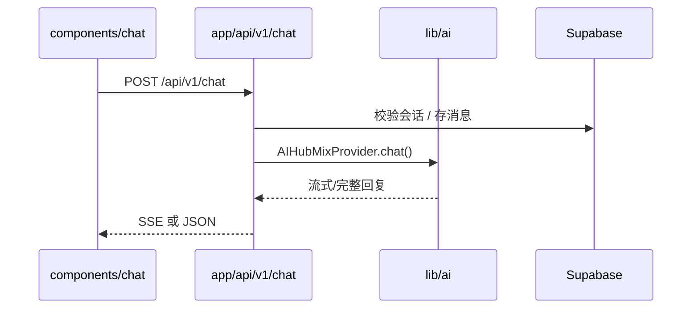

# MCN AI 系统架构

## 产品定位

MCN AI 是面向带货创作者的长期迭代 SaaS 平台。当前阶段以 **对话 + 角色** 为核心；路线图包括 **知识库、爬虫、自动剪辑** 等能力。

## 技术栈

| 层级 | 选型 |
|------|------|
| 前端框架 | Next.js 14（App Router） |
| 语言 | TypeScript（严格模式） |
| UI | Tailwind CSS + shadcn/ui（neutral 主题） |
| 数据库 & 认证 | Supabase |
| AI | AIHubMix（OpenAI SDK 兼容） |

## 目录与职责

```
mcn-ai/
├── app/              # 路由、页面、API Route Handlers
├── components/       # React 组件（ui / chat / admin / shared）
├── lib/              # 业务逻辑、Provider、Supabase 客户端
├── config/           # 环境变量与全局配置
├── types/            # 共享类型
├── scripts/          # 开发/运维脚本
└── docs/             # 架构与决策记录
```

### 请求流（对话）



## 模块边界

### `lib/ai/`

- `providers/base.ts`：定义 `AIProvider` 接口，便于未来切换或组合多个 Provider
- `providers/aihubmix.ts`：AIHubMix 实现（`baseURL: https://aihubmix.com/v1`）
- `prompts/`：系统 Prompt 与角色模板

### `lib/supabase/`

- `client.ts`：浏览器端 Client Component 使用
- `server.ts`：Server Component / Route Handler 使用
- `middleware.ts`：刷新 Auth Session

### `lib/events/` 与 `lib/audit/`

- **events**：应用内发布/订阅，用于解耦（如消息发送后触发统计）
- **audit**：敏感操作审计，未来写入 `audit_logs` 表

### `app/api/v1/`

版本化 API，避免破坏性变更影响旧客户端：

| 路由 | 职责 |
|------|------|
| `chat/` | 对话补全（流式） |
| `conversations/` | 会话 CRUD |
| `roles/` | 角色/Prompt 配置 |
| `auth/` | 认证相关桥接 |

## 扩展路线图

| 阶段 | 模块 | 建议落点 |
|------|------|----------|
| 知识库 | 文档上传、向量检索 | `lib/knowledge/` + Supabase pgvector |
| 爬虫 | 数据采集任务 | `lib/crawler/` + 后台 Job 队列 |
| 自动剪辑 | 视频流水线 | `lib/media/` + 外部 FFmpeg 服务 |

新增一级目录时，同步更新本文件与对应 `README.md`。

## 环境变量

复制 `.env.local.example` 为 `.env.local` 并填写：

- `NEXT_PUBLIC_SUPABASE_*` — 前端与 RLS 使用的公开密钥
- `SUPABASE_SERVICE_ROLE_KEY` — 仅服务端、绕过 RLS 的管理操作
- `AIHUBMIX_API_KEY` — AI 调用密钥

## 路径别名

`tsconfig.json` 配置 `@/*` → 项目根目录，与 shadcn/ui `components.json` 保持一致。
